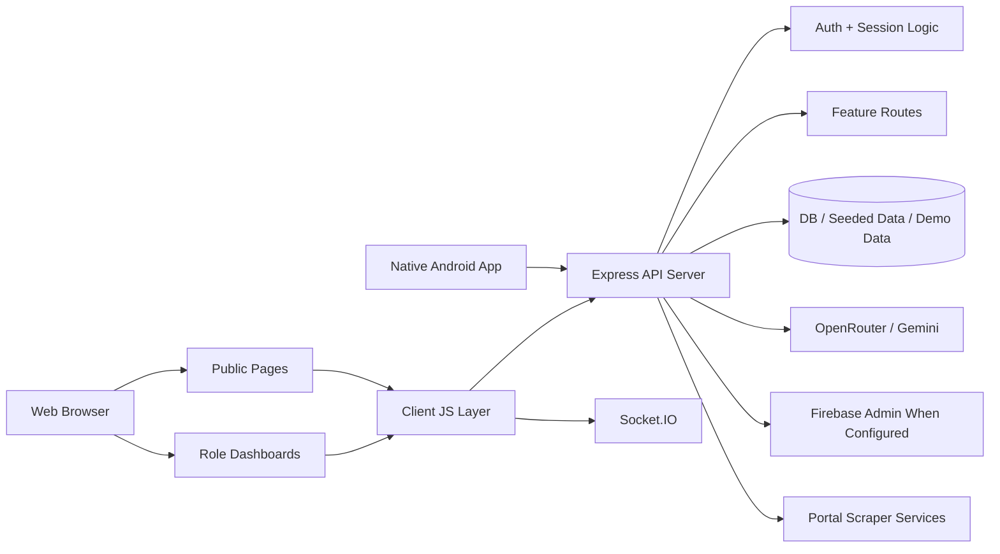
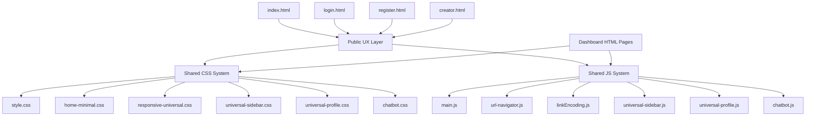
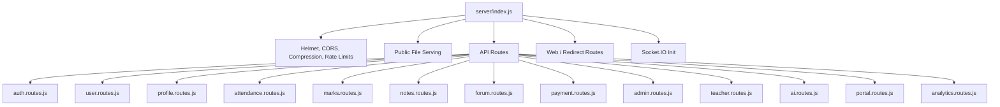
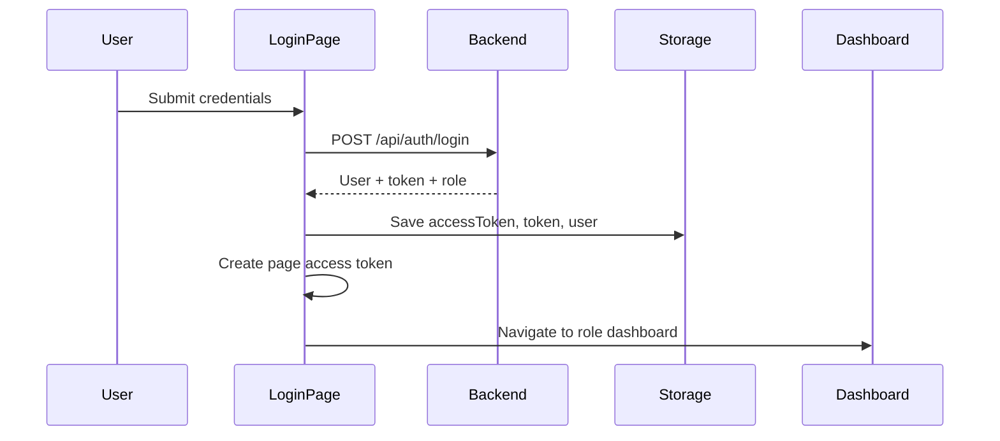
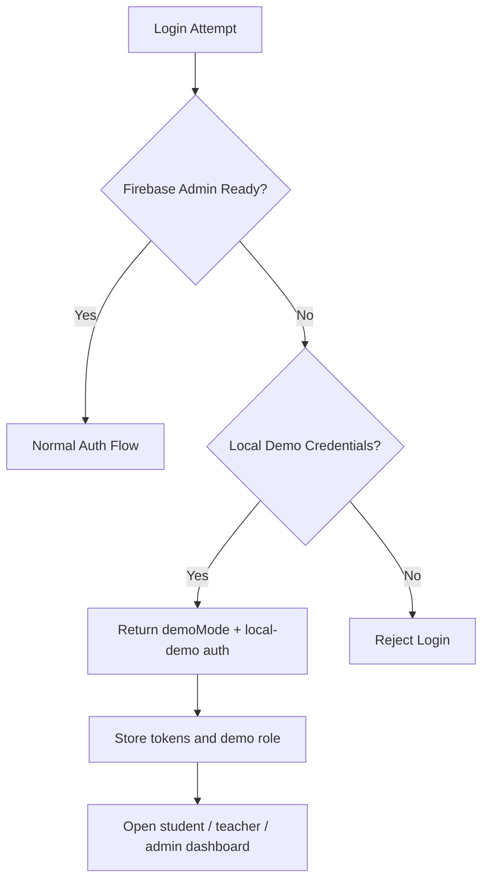
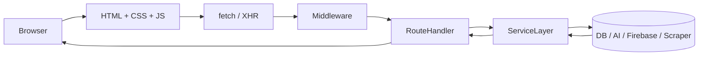
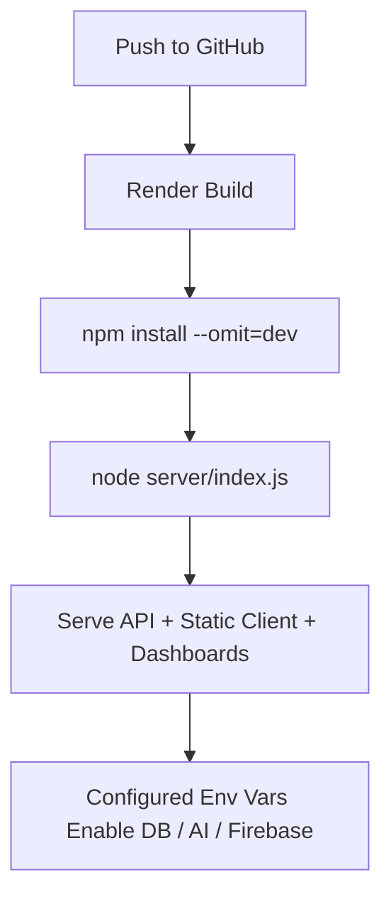

# ITERasn hub

ITERasn hub is a full-stack college portal for students, teachers, and administrators. It combines a vanilla HTML/CSS/JavaScript frontend with a Node.js + Express backend, role-based dashboards, AI-assisted features, demo-mode local login, payment/admit-card flows, real-time notifications, an optional scraper package, and a native Android client under `android-app/`.

This README is the single consolidated project document for the repository. It replaces the old scattered setup notes, deployment guides, fix summaries, UI notes, and feature-specific Markdown files that previously lived across the repo.

## Contents

1. Project Overview
2. Core Capabilities
3. System Architecture
4. Application Workflows
5. Repository Structure
6. Frontend Surface Map
7. Backend Surface Map
8. Local Development Setup
9. Demo Accounts for Local Testing
10. Environment Variables
11. Database, Seeding, and Demo Data
12. AI Services
13. Portal Scraper
14. Android App
15. Deployment on Render
16. Testing and Verification
17. Troubleshooting
18. Security Notes
19. Current Project Status

## Project Overview

### What this project is

ITERasn hub is an academic operations portal designed around three primary roles:

- `Student`: attendance, marks, notes, timetable, payments, events, clubs, hostel menu, admit card, forum, AI assistant
- `Teacher`: attendance marking, marks upload, assignments, notes, question bank, rubric creation, student management
- `Admin`: users, approvals, analytics, departments, announcements, settings

### Main technical characteristics

- Frontend: vanilla HTML, CSS, and JavaScript
- Backend: Node.js with Express
- Real-time layer: Socket.IO
- Data layer: hybrid SQL + Firebase backend. Academic/admin records come from the active SQL adapter, while auth, files, forum, payments, and stored portal imports use Firebase Admin when configured.
- Auth: JWT-based app auth plus Firebase-backed flows where configured
- AI: OpenRouter and Gemini integration
- Deployment target: Render
- Extra delivery targets: native Android app and optional scraper package

### Current branding and UX direction

- Product name: `ITERasn hub`
- Visual language: minimalist, Nothing-inspired, dark/off-white surfaces with warm coral accents
- Public routing: direct public routes for home, creator, login, and register
- Dashboard routing: direct dashboard URLs with protected access and token checks

## Core Capabilities

### Student experience

- Student dashboard overview
- Attendance tracking
- Marks and academic performance
- Timetable
- Study notes and PYQs
- Admit card view/download
- Events and clubs
- Hostel menu
- Forum
- AI assistant
- Payment history, payment details, payment flow

### Teacher experience

- Teacher dashboard overview
- Attendance management
- Marks upload
- Assignment management
- Notes/material upload
- Question bank
- Rubric creator
- Student list and related workflows

### Admin experience

- Admin dashboard overview
- User management
- Approval queue
- Announcements
- Departments
- Analytics
- Settings

### Shared platform features

- Direct public-page navigation
- Theme toggle with persistence
- Chatbot widget
- Universal sidebar and profile system
- Mobile-friendly responsive shell
- Demo-mode local login fallback
- Service worker and manifest for app-like behavior
- Static asset serving plus role dashboards

## System Architecture

### High-level architecture



### Frontend architecture



### Backend architecture



## Application Workflows

### Login and role redirect flow



### Local demo auth fallback



### Request lifecycle



## Repository Structure

```text
.
├── client/
│   ├── index.html
│   ├── login.html
│   ├── register.html
│   ├── creator.html
│   ├── dashboard/
│   ├── css/
│   ├── js/
│   ├── assets/
│   └── partials/
├── server/
│   ├── index.js
│   ├── routes/
│   ├── services/
│   ├── middleware/
│   ├── database/
│   ├── seed/
│   └── scripts/
├── android-app/
├── soa-student-scraper/
├── render.yaml
├── package.json
└── .env.example
```

### Important frontend files

- `client/index.html`: redesigned homepage
- `client/login.html`: login with demo account quick-fill and Google login path
- `client/register.html`: registration page
- `client/creator.html`: creator/about page
- `client/css/style.css`: main shared visual system
- `client/css/home-minimal.css`: public-facing home/auth/creator styling layer
- `client/css/responsive-universal.css`: global responsive rescue layer
- `client/css/universal-sidebar.css`: shared dashboard sidebar shell
- `client/css/universal-profile.css`: shared profile/dropdown shell
- `client/css/chatbot.css`: chatbot widget shell
- `client/js/main.js`: shared application helpers and theme logic
- `client/js/linkEncoding.js`: URL handling rules
- `client/js/url-navigator.js`: safe navigation helpers
- `client/js/universal-sidebar.js`: sidebar rendering and behavior
- `client/js/universal-profile.js`: profile UI behavior
- `client/js/chatbot.js`: chatbot behavior and AI request handling

### Important backend files

- `server/index.js`: server bootstrap, middleware, routes, static serving
- `server/routes/auth.routes.js`: login, role auth, local demo fallback
- `server/database/firebase.js`: Firebase admin setup and local fallback compatibility
- `server/services/ai.service.js`: Gemini AI service
- `server/services/openrouter.service.js`: OpenRouter service
- `server/routes/redirect.routes.js`: encoded link redirect support
- `server/routes/web.routes.js`: web session route handling
- `server/seed/seed.js`: baseline data seeding
- `server/seed/comprehensive-seed.js`: broader seed flow
- `server/scripts/*`: DB and utility scripts

## Frontend Surface Map

### Public pages

- `/` or `/index.html`
- `/login.html`
- `/register.html`
- `/creator.html`
- `/connect-portal.html`

### Student dashboard pages

- `/dashboard/student.html`
- `/dashboard/student-attendance.html`
- `/dashboard/student-marks.html`
- `/dashboard/student-timetable.html`
- `/dashboard/student-notes.html`
- `/dashboard/student-admit-card.html`
- `/dashboard/student-events.html`
- `/dashboard/student-clubs.html`
- `/dashboard/student-hostel-menu.html`
- `/dashboard/student-forum.html`
- `/dashboard/student-ai-assistant.html`
- `/dashboard/student-payment-history.html`
- `/dashboard/student-payment-details.html`
- `/dashboard/student-payment-make.html`

### Teacher dashboard pages

- `/dashboard/teacher.html`
- `/dashboard/teacher-attendance.html`
- `/dashboard/teacher-marks.html`
- `/dashboard/teacher-assignments.html`
- `/dashboard/teacher-notes.html`
- `/dashboard/teacher-question-bank.html`
- `/dashboard/teacher-rubric-creator.html`
- `/dashboard/teacher-students.html`

### Admin dashboard pages

- `/dashboard/admin.html`
- `/dashboard/admin-users.html`
- `/dashboard/admin-approvals.html`
- `/dashboard/admin-analytics.html`
- `/dashboard/admin-announcements.html`
- `/dashboard/admin-departments.html`
- `/dashboard/admin-settings.html`

## Backend Surface Map

### Route groups

- `/api/auth`
- `/api/users`
- `/api/profile`
- `/api/admitcard`
- `/api/attendance`
- `/api/marks`
- `/api/files`
- `/api/events`
- `/api/assignments`
- `/api/timetable`
- `/api/hostel`
- `/api/admin`
- `/api/teacher`
- `/api/analytics`
- `/api/notifications`
- `/api/search`
- `/api/health`
- `/api/bulk`
- `/api/ai`
- `/api/question-bank`
- `/api/rubrics`
- `/api/notes`
- `/api/forum`
- `/api/pyq`
- `/api/portal`
- `/api/payments`
- `/api/soa`

### Supporting web routes

- `/web/*`: obfuscated web/session routes retained for legacy flows
- `/r/*`: encoded redirect handler retained for legacy links
- direct public routes: `/`, `/index.html`, `/login.html`, `/register.html`, `/creator.html`

## Local Development Setup

### Prerequisites

- Node.js `>= 18`
- npm
- MySQL if you want full DB-backed local development
- Optional:
  - Firebase service account for production-like auth
  - OpenRouter and/or Gemini keys for AI
  - Python/portal stack if you plan to use scraper integrations

### Install dependencies

```bash
npm install
```

### Configure environment

```bash
cp .env.example .env
```

Then update the values you actually want to use. At minimum:

- `PORT`
- `CLIENT_URL`
- `DB_HOST`
- `DB_PORT`
- `DB_USER`
- `DB_PASSWORD`
- `DB_NAME`
- `JWT_SECRET`
- `JWT_REFRESH_SECRET`

### Start the app

```bash
npm run dev
```

Expected local endpoints:

- frontend: `http://localhost:3000`
- backend: `http://localhost:5000`

### Useful scripts

```bash
npm run dev
npm start
npm run dev:client
npm run seed
npm run seed:comprehensive
npm run db:verify
npm run verify:ai
npm test
npm run test:e2e
```

## Demo Accounts for Local Testing

If Firebase Admin is not initialized locally, the app supports demo login fallback for all three roles.

### Demo credentials

| Role | Registration Number | Password |
| --- | --- | --- |
| Student | `STU20250001` | `Student@123` |
| Teacher | `TCH2025001` | `Teacher@123` |
| Admin | `ADM2025001` | `Admin@123456` |

### What happens in local demo mode

- login succeeds without Firebase Admin
- `accessToken` and legacy `token` keys are stored
- `demoMode`/prototype mode behavior is enabled where required
- role-based dashboard redirect still happens
- many dashboard pages can fall back to dummy/demo data for local testing

## Environment Variables

### Core application

- `NODE_ENV`
- `PORT`
- `CLIENT_URL`
- `CORS_WHITELIST`
- `SOCKET_CORS_ORIGIN`

### Database

- `DB_HOST`
- `DB_PORT`
- `DB_USER`
- `DB_PASSWORD`
- `DB_NAME`
- `DATABASE_URL` for hosted environments where used

### JWT and auth

- `JWT_SECRET`
- `JWT_REFRESH_SECRET`
- `JWT_EXPIRE`
- `JWT_REFRESH_EXPIRE`

### Firebase Admin

Use either the single JSON string or split variables:

- `FIREBASE_SERVICE_ACCOUNT`
- `FIREBASE_PROJECT_ID`
- `FIREBASE_CLIENT_EMAIL`
- `FIREBASE_PRIVATE_KEY`

### AI providers

- `OPENROUTER_API_KEY`
- `GEMINI_API_KEY`
- `GEMINI_MODEL`

### Optional Google integrations

- `GOOGLE_VISION_API_KEY`
- `GOOGLE_DRIVE_FOLDER_ID`
- `GOOGLE_SERVICE_ACCOUNT`
- `GOOGLE_APPLICATION_CREDENTIALS`

### File and storage

- `UPLOAD_DIR`
- `MAX_FILE_SIZE`
- `STORAGE_MODE`
- `BACKUP_DIR`
- `BACKUP_RETENTION_COUNT`

### Feature flags and portal integration

- `PORTAL_FEATURES_ENABLED`
- `FLASK_SCRAPER_URL`

### Redis

- `REDIS_URL`
- or split host/port/password settings if you use Redis directly

### Important note

Replace any placeholder/example values before deployment. Do not rely on example keys or secrets in committed examples for real environments.

## Database, Seeding, and Demo Data

### Standard seed

```bash
npm run seed
```

### Comprehensive seed

```bash
npm run seed:comprehensive
```

### Profile-oriented seed

```bash
npm run seed:profile
```

### Verification

```bash
npm run db:verify
```

### Local fallback behavior

This project contains multiple layers for local testing:

- regular DB-backed data when configured
- seeded data after running seed scripts
- demo auth fallback if Firebase Admin is missing
- dummy/prototype data in parts of the dashboard when full backends are unavailable

## AI Services

### Available AI providers

- OpenRouter
- Gemini

### Main AI usage areas

- chatbot responses
- general Q&A
- educational assistance
- some portal/captcha related support paths

### Local AI setup

Set at least one of:

```env
OPENROUTER_API_KEY=sk-or-v1-your-openrouter-key
OPENROUTER_CHAT_MODEL=nvidia/nemotron-3-super-120b-a12b:free
OPENROUTER_CHAT_FALLBACK_MODELS=google/gemma-3-27b-it:free,arcee-ai/trinity-large-preview:free,google/gemma-3-12b-it:free,mistralai/mistral-small-3.1-24b-instruct:free,google/gemma-3-4b-it:free
OPENROUTER_CAPTCHA_MODEL=nvidia/nemotron-nano-12b-v2-vl:free
OPENROUTER_CAPTCHA_FALLBACK_MODELS=google/gemma-3-27b-it:free,mistralai/mistral-small-3.1-24b-instruct:free,google/gemma-3-12b-it:free,google/gemma-3-4b-it:free
GEMINI_API_KEY=your-gemini-key
GEMINI_MODEL=gemini-1.5-flash
```

For Render, keep `OPENROUTER_API_KEY` as a secret env var in the Render dashboard or `render.yaml` sync settings. Do not commit the real key into `.env.example` or tracked files.

### Validate AI wiring

```bash
npm run verify:ai
npm run check:ai
```

## Portal Scraper

The repository includes scraper-related backend services and a separate scraper package under `soa-student-scraper/`.

### Relevant server-side files

- `server/services/portal-scraper.service.js`
- `server/services/portal-scraper-server.js`
- `server/routes/portal.routes.js`
- `server/routes/soa.routes.js`

### Feature-flag behavior

Portal features are disabled by default in example/local setup through:

```env
PORTAL_FEATURES_ENABLED=false
```

### Hosted deployment note

`render.yaml` explicitly disables portal features on free-tier Render deploys:

- `PORTAL_FEATURES_ENABLED=false`

That prevents scraper-heavy behavior from breaking lightweight hosted environments.

## Android App

The canonical Android path in this repository is the native app under `android-app/`. Do not use WebView, TWA, Bubblewrap, or browser-shell guidance from older repo history.

### Audit summary of the pre-migration Android state

- `android-app/app/src/main/java/edu/iter/eduhub/MainActivity.java` loaded the hosted site directly in a `WebView`
- `android-app/app/build.gradle` previously targeted `minSdk 28`, which did not satisfy the Android 10+ requirement
- `scripts/build-android.js` previously generated Bubblewrap/TWA output under `releases/android`
- `build-android.ps1` previously patched a website URL into the Android shell before building

That older wrapper approach was not independent from the website frontend and is no longer the supported Android strategy.

### Native Android architecture

The Android app is intended to be a real client for the same backend, not a packaged website. The target architecture is:

- Kotlin
- Jetpack Compose for all UI
- Navigation Compose for role-aware navigation
- ViewModel + unidirectional state flow
- Retrofit/OkHttp for API access
- encrypted or otherwise protected session storage for app tokens
- native Android file pickers, downloads, and document intents for attachments/PDF flows

The detailed Android audit, parity matrix, backend contract notes, and QA checklist are tracked in `android-app/NATIVE_MIGRATION_AUDIT.md`.

### Android and backend data sources

The Android app uses the same backend/API layer as the website. It does not initialize a separate Firebase client SDK or maintain a second mobile-only database.

- SQL-backed data: attendance, marks, timetable, assignments, analytics, departments, and most admin reporting
- Firebase-backed data: users/auth records, file metadata, forum questions/answers, payments, AI chat logs/study plans, and stored portal imports under the user document
- Shared portal normalization: `server/services/soa-data.service.js` converts imported portal data into a stable contract used by both website fallbacks and Android snapshot payloads

For Android parity, configure the backend with the same Firebase Admin project the website/server uses. The native app then reaches that shared data through `/api/*`, not by reading Firestore directly.

### Android information architecture

The native app mirrors the website information architecture with native screens for:

- public: home, login, register, creator, connect-portal
- student: dashboard, attendance, marks, timetable, notes, admit card, events, clubs, hostel menu, forum, AI assistant, payments
- teacher: dashboard, attendance, marks, assignments, notes, question bank, rubric creator, students
- admin: dashboard, users, approvals, analytics, announcements, departments, settings
- shared: profile/session, notifications, search, file handling, loading/error/retry states

### Build the native app

From the repository root:

```bash
npm run build:android
```

That script now builds the native app in `android-app/` and optionally copies the produced APK into `releases/android/`.

Direct Gradle usage is also supported:

```bash
cd android-app
./gradlew testDebugUnitTest assembleDebug
```

For a release build:

```bash
cd android-app
./gradlew testDebugUnitTest assembleRelease
```

PowerShell helper:

```powershell
./build-android.ps1
./build-android.ps1 -Release
```

### Android setup prerequisites

- Android Studio Hedgehog or newer, or a recent command-line Android SDK
- JDK 17
- Android SDK / emulator for local device testing
- backend access to a reachable API URL for the environment you are testing against
- copy `android-app/local.properties.example` to `android-app/local.properties` if your local SDK path is not auto-generated

### Android verification expectations

Before calling Android parity complete, verify at least:

- fresh install on Android 10+ / API 29+
- login for student, teacher, and admin roles
- logout and session restore after app restart
- role-based navigation to all core screens
- file upload/download handling
- admit-card or PDF open/download handling
- network failure, retry, and slow-loading states
- back navigation, app resume, and configuration-change behavior

### Parity note

The Android app should use the backend/API layer only. Reusing backend rules is expected; rendering website HTML/CSS/JS inside Android UI is not. If parity gaps remain, document them as backend or Android implementation gaps, not as acceptable wrapper behavior.

## Deployment on Render

### Render service definition

Deployment is configured in `render.yaml`.

### Render defaults in this repo

- service type: `web`
- environment: `node`
- start command: `node server/index.js`
- build command: `npm install --omit=dev`
- disk mounted for uploads

### Required Render environment variables

At minimum, configure:

- `DATABASE_URL` or equivalent DB connectivity for your environment
- `JWT_SECRET`
- `JWT_REFRESH_SECRET`
- `CORS_WHITELIST`
- AI vars if you want AI in production
- Firebase admin variables if you want full production auth flows

### Render deployment flow



### Important Render notes

- uploads volume is mounted through Render disk config
- portal features are disabled by default in `render.yaml`
- AI and Firebase require real env vars on Render
- direct public routes and direct dashboard routes are now important to current navigation behavior
- the current `render.yaml` uses `plan: free`, so Render can spin the service down after inactivity
- this repo now includes `.github/workflows/render-keepalive.yml`, which pings the Render `/health` endpoint every 10 minutes as a best-effort warm-up strategy
- by default the keepalive targets `https://iter-aio.onrender.com/health`; if your Render URL is different, set a GitHub Actions repository variable or secret named `RENDER_HEALTHCHECK_URL`
- this keepalive reduces cold starts on free tier, but only a paid Render instance can reliably guarantee an always-on service

## Testing and Verification

### Automated commands available

```bash
npm test
npm run test:e2e
npm run test:scraper
npm run db:verify
npm run verify:ai
npm run check:ai
npm run build:android
```

### Manual verification checklist

- open home page
- verify creator, login, register links
- log in with student demo credentials
- log in with teacher demo credentials
- log in with admin demo credentials
- verify role dashboard loads
- test theme toggle on public pages and dashboards
- test chatbot open/close and a general question
- test mobile navigation and sidebar behavior
- build `android-app/` with Gradle
- install the APK on an Android 10+ device or emulator
- log in on Android as student, teacher, and admin
- verify Android session restore after app restart
- verify Android file download/upload and admit-card/PDF handling
- verify Android error, retry, and back-navigation behavior

## Troubleshooting

### Login works but redirects to a broken path

Cause:

- dashboard URLs were historically being encoded/rewritten incorrectly

Current expectation:

- dashboard routes should resolve directly like `/dashboard/student.html`

### Firebase Admin SDK not initialized

For local testing:

- use the demo credentials listed in this README

For production-like auth:

- provide `FIREBASE_SERVICE_ACCOUNT`
- or provide split Firebase env vars

### AI chatbot gives fallback or unavailable responses

Check:

- `OPENROUTER_API_KEY`
- `OPENROUTER_CHAT_MODEL`
- `OPENROUTER_CHAT_FALLBACK_MODELS`
- `GEMINI_API_KEY`
- `GEMINI_MODEL`
- `npm run verify:ai`

### Local app starts but pages look broken

Check:

- run from repo root
- ensure static frontend is served on `3000`
- ensure backend is on `5000`
- hard refresh the browser after major CSS/JS changes

### Database issues

Check:

- `.env` DB settings
- MySQL availability
- `npm run seed`
- `npm run db:verify`

## Security Notes

- replace all placeholder/example secrets before deploying
- keep Firebase admin credentials out of source control
- keep AI keys out of source control
- use strong JWT secrets in production
- review `.env.example` and clean any sample values before using it as a production baseline

## Current Project Status

### What is already in place

- role-based dashboards
- direct public routing
- responsive redesign work across public and dashboard surfaces
- creator/login/register/home alignment improvements
- chatbot styling and shorter general-answer behavior
- local demo auth fallback for all three primary roles
- Render deployment file
- native Android app path under `android-app/`
- scraper-related code and package

### Android status rule

- the supported Android direction is native-only
- do not regenerate or reintroduce WebView/TWA/Bubblewrap delivery paths
- if a screen is not implemented natively yet, record it as a parity gap rather than routing users back into the website frontend

### What this README now replaces

This file supersedes the previous scattered repository docs covering:

- setup and quick starts
- deployment notes
- UI/UX redesign summaries
- responsive-fix summaries
- AI setup notes
- scraper notes
- dashboard enhancement summaries
- dummy-data notes
- testing checklists
- architecture references

### Documentation policy going forward

Use this root `README.md` as the canonical project document. If the project evolves, update this file instead of creating new standalone summary Markdown files unless there is a very strong reason to keep documentation in a separate location.
